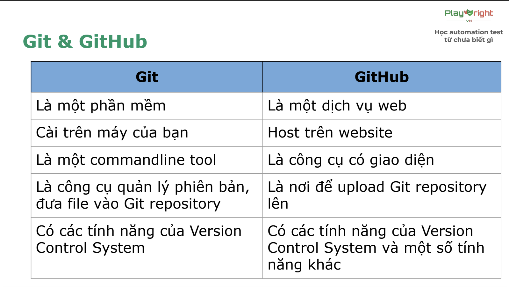

# Version Control System
## Definenation: 
    Lưu trữ và quản lý các change version, bao gồm: Version change, tác giả, ngày giờ change, nội dung change
## Type of VCS:
    3 types of VCS:
    - Local: Lưu trên máy cá nhân
    - Centralize: Lưu ở một máy chủ tập trung
    - Distributed(phân tán): Lưu trên nhiều máy

# Git
## Defination:
    Là một distributed VCS, dùng để theo dõi sự thay đổi của mã nguồn trong quá trình phát triển phần mềm. Giúp các member phối hợp làm việc dễ dàng quản lý, chỉnh sửa và lưu trữ code.
## Git & Github
    
    
## 3 trạng thái của Git
    1. Working directory
        Quản lý các file mới hoặc các file có thay đổi. Khi gọi câu lệnh git status, text sẽ được highlight red
    2. Staging area
        Các file đưa vào vùng chuẩn bị commit(tạo ra các phiên bản). Khi gọi lệnh git status, text sẽ được highlight green
    3. Repository
        Các commit (phiên bản)
## Git flow
    - Không dùng global config:
        init -> config -> add -> commit -> push
    - Dùng global config:
        init -> add -> commit -> push
## Các câu lệnh làm việc với git
    1. Câu lệnh khởi tạo thư mục *git init*
        khởi tạo thư mục được quản lý bởi git
        Chỉ chạy duy nhất lần đầu tiên
    2. Câu lệnh cấu hình git "git config":
        - Config riêng lẻ cho 1 repo:
            **git config user.name "<name>"**
            **git config user.email "<email>"**
        - Config cho toàn bộ máy tính:
            **git config --global user.name "<name>"**
            **git config --global user.email "<email>"**
    3. Thêm file vào Staging area:
        - Thêm 1 file:
            **git add <tên file>**
            Đưa file tạo mới và thay đổi từ vùng Working directory sang vùng Staging
        - Thêm tất cả các files:
            *git add .*
            Đưa tất cả các file tạo mới và thay đổi trong Working Directory sang Staging 
    4. Commit
        **git commit -m "message"**
        Đưa các file từ Staging area lên Repository
    5. Push
        **git push origin main**
        Đẩy code lên github
    6. Một số câu lệnh git thường dùng khác:
        - **git status**
        Lấy trạng thái các file, khi in ra màn hình, tên file thuộc vùng *Working Directory* sẽ có màu đỏ, files thuộc vùng *Staging area* sẽ có màu xanh lá cây.
        - **git log**
        Kiểm tra lịch sử commit
    7. Quy ước đặt message cho commit:
        **<type>: <Short description>**
        - Type: Loại commit:
            . chore: Sửa nhỏ lẻ, chính tả, xoá file không dùng tới
            . feat: Thêm tính năng mới, testcase mới
            . fix: Sửa lỗi 1 test trước đó
        - Short description:
            Mô tả ngắn gọn (50 kí tự) bằng tiếng anh hoặc tiếng việt k dấu
            vd: "chore: remove unuse file"
                "feat: add code for exercises 2"
# Javascript
## Defination:
    Là ngôn ngữ lập trình dùng để tương tác trên web, vd hiển thị alert, tạo menu droplist, cập nhật nội dung trang mà k cần tải lại, xử lý form & dữ liệu người dùng nhập, các hiệu ứng trên web khác,...
    File javascript có định dạng .js
## Javascript basic
### Variable
    **var <tên biến> = <giá trị>**
    **let <tên biến> = <giá trị>**
    - Dùng var với biến global (phạm vi toàn cục), dùng let trong phạm vi nhỏ hơn (trong {})
    Nên dùng let để dễ kiểm soát biến.
    - Khi dùng let để khai báo biến, không thể khai báo lại biến đó, nhưng có thể gán lại giá trị cho biến.
    Dùng var có thể khai báo lại.
    - Đặt tên biến bắt đầu bằng _,chữ, hoặc $
    - Tên biến k được chứa dấu cách, k dc trùng với từ khoá vd let, var, for if,...
### Constant
    **const <name> = <value>**
    Không thể thay đổi giá trị của hằng số 
### Data type
    Có 8 loại kiểu dữ liệu: String (chuỗi), Number (số nguyên), Bigint, Boolean (True/fale), Undefined, Null, Symbol, Object.
### Comparison operator(toán tử so sánh)
    - Dùng để so sánh 2 biến với nhau
    - Toán tử so sánh: > , <, >=, <=, ==, ===, !==, !=
### Unary operator(toán tử 1 ngôi)
    - Dùng để tăng hoặc giảm giá trị
    - i++ bằng với i = i + 1
    - i-- bằng với i = i - 1
### Arithmetic operator (toán tử số học)  
    - Dùng để tính toán giá trị biểu thức +, -, *, /
### Conditional với if
    - Cú pháp:
    **if (<điều kiện>) { //code }**
    - Trong đó điều kiện dùng để kiểm tra xem có chạy code trong {} không.
    - vd: if (5 > 3) { console.log("5 lớn hơn 3")}
### Loops vs for
    - Cú pháp:
   **for(<khởi tạo>; <điều kiện dừng>; <điều kiện tăng>) { // code }**
    - Dùng để thực hiện 1 đoạn logic 1 số lần nhất định
    - vd: Ví dụ: for (let i = 1; i <= 10; i++) { console.log("Giá trị của i là: ", i);}
### Câu lệnh in ra màn hình
    console.log("Hello world");
    Khi dùng string có thể dùng " " , hoặc ' ', ` `
### Câu lệnh run file
    node <Relative path file>
### Format code
    Mac: Option + Shift + F
    Window: Alt + Shift + F

